# NXP VEE for i.MX RT595 EVK v1.0
This project is used to build an NXP VEE Port for the [i.MX RT595 EVK](https://www.nxp.com/design/development-boards/i-mx-evaluation-and-development-boards/i-mx-rt595-evaluation-kit:MIMXRT595-EVK) with a [watch display panel](https://www.nxp.com/part/G1120B0MIPI#/).


VEE stands for Virtual Execution Environment and provides a hardware abstraction to develop applications in high level programming languages such as Java.
NXP VEE is built upon [MicroEJ technology](https://www.microej.com/product/vee/).

This release provides:

* an i.MX RT595 EVK simulator to develop VEE applications and test them on a host PC
* a front panel showing the EVK and its display in the simulator
* the necessary recipes to embed the VEE architecture for GCC
* various [Foundation Libraries](https://docs.microej.com/en/latest/ApplicationDeveloperGuide/libraries.html) to provide high level libraries to developers
* in particular, Foundation Libraries [MicroUI](https://docs.microej.com/en/latest/ApplicationDeveloperGuide/UI/MicroUI/index.html#section-app-microui) to create user interfaces and [MicroVG](https://docs.microej.com/en/latest/ApplicationDeveloperGuide/UI/MicroVG/index.html) to provide accelerated vector drawing capabilities
* [MCUXpresso SDK](https://mcuxpresso.nxp.com/en/welcome) 2.12.0
* sample applications demonstrating NXP VEE:
    * SimpleGFX: draw moving NXP coloured boxes using MicroUI
    * AnimatedMascot: draw an animated [Android Vectordrawable](https://developer.android.com/develop/ui/views/graphics/vector-drawable-resources) image using MicroVG
* a [mock](https://docs.microej.com/en/latest/PlatformDeveloperGuide/mock.html) to give Java implementations for C native functions used by application SimpleGFX


## VEE Port Specifications
The architecture version is 7.17.0.
This VEE Port provides the following Foundation Libraries:

|Foundation Library|Version|
|------------------|-------|
|UI-PACK           |13.3.1 |
|VG-PACK           |1.1.1  |


## Requirements
* PC with Windows 10 or Linux (tested on Debian 11)
* Java JDK 1.8 or 1.11
* Internet connection to [MicroEJ Central Repository](https://developer.microej.com/central-repository/)
* i.MX RT595 EVK board, available [here](https://www.nxp.com/design/development-boards/i-mx-evaluation-and-development-boards/i-mx-rt595-evaluation-kit:MIMXRT595-EVK)
* G1120B0MIPI display panel, available [here](https://www.nxp.com/part/G1120B0MIPI#/)
* Optionally: J-Link Debugger to flash the software


## Directory structure
```
nxp-vee-rt595
├───Documentation
├───Licenses
├───nxpvee-mimxrt595-evk-round-fp
├───nxpvee-mimxrt595-evk-round-imageGenerator
├───MIMXRT595-evk_platform-CM4hardfp_GCC48-1.0.0
│   └─> Directory holding the VEE runtime files
├───nxpvee-mimxrt595-evk-round-apps
│   └─> Java High Level applications project
├───nxpvee-mimxrt595-evk-round-bsp
│   └─> C BSP project
├───nxpvee-mimxrt595-evk-round-configuration
│   └─> VEE project directory
├───nxpvee-mimxrt595-evk-round-mock
│   └─> Project holding mockup functions
└───nxpvee-mimxrt595-evk-round-validation
    └─> Project holding Java tests to validate the VEE
```


## Preliminary steps

### Fetch the source code
Clone the repository with the following command:

`git clone https://github.com/nxp-mcuxpresso/nxp-vee-imxrt595-evk.git -b round`

### Get the MicroEJ SDK
The MicroEJ SDK is an Eclipse-based IDE used to build the VEE Port and the high level applications. It is able to run a simulator of the target hardware.

Java JDK is required by the MicroEJ SDK. JDK version [depends on the MicroEJ SDK version](https://docs.microej.com/en/latest/SDKUserGuide/systemRequirements.html).

This release has been tested with MicroEJ SDK 21.11 and Java JDK 1.8.

Download MicroEJ SDK 21.11 [here](https://docs.microej.com/en/latest/SDKUserGuide/installSDKDistribution21_11.html#sdk-installation-21-11).

### Get a C toolchain
To build an image that runs on target, you need a Cortex-M toolchain.
The toolchain used to validate this release is the [GNU ARM Embedded Toolchain 10.3-2021.10](https://developer.arm.com/downloads/-/gnu-rm).

**Toolchain for Linux**: [gcc-arm-none-eabi-10.3-2021.10-x86_64-linux.tar.bz2](https://developer.arm.com/-/media/Files/downloads/gnu-rm/10.3-2021.10/gcc-arm-none-eabi-10.3-2021.10-x86_64-linux.tar.bz2?rev=78196d3461ba4c9089a67b5f33edf82a&hash=D484B37FF37D6FC3597EBE2877FB666A41D5253B)

**Toolchain for Windows**: [gcc-arm-none-eabi-10.3-2021.10-win32.exe](https://developer.arm.com/-/media/Files/downloads/gnu-rm/10.3-2021.10/gcc-arm-none-eabi-10.3-2021.10-win32.exe?rev=29bb46cfa0434fbda93abb33c1d480e6&hash=3C58D05EA5D32EF127B9E4D13B3244D26188713C)

### Import the project in a new workspace
Launch MicroEJ SDK and create a blank workspace.

Import the cloned repository as an existing project:


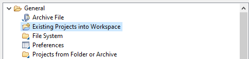


Then select all projects from the repository:

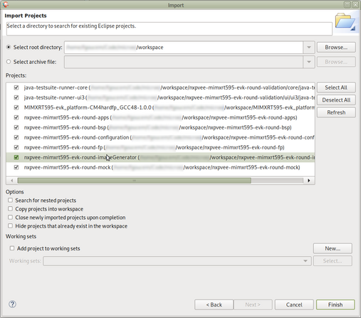

The package explorer view should look like this:

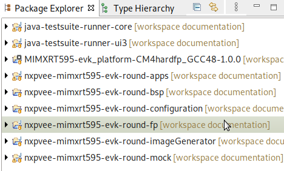

### Build the platform
First thing to build with the IDE is the platform for the board.
For demonstration purposes, one of the examples of the release uses a mockup (more details follow in the native functions description). The mockup is a dependency of the platform and must therefore be built beforehand.

#### Build the mockup
Right click on the mockup project and select `Build Module`:


#### <a name="build-the-platform"></a> Build the platform
Once the mockup dependency is resolved, the platform can be built.
Right click on the configuration project and select `Build Module`:

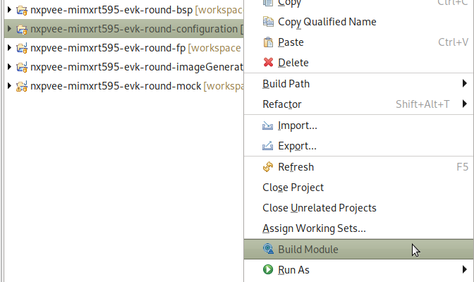

Building the platform will populate the initally empty `MIMXRT595-evk_platform-CM4hardfp_GCC48-1.0.0` project which will be used to build VEE applications.


## Build and run applications
Two example VEE applications are provided with this release.

Application `SimpleGFX` displays three moving rectangles using the [MicroUI API](https://docs.microej.com/en/latest/ApplicationDeveloperGuide/UI/MicroUI/index.html#section-app-microui). The coordinates of the rectangles are calculated in C native functions.

Application `AnimatedMascot` draws an animated [Android Vectordrawable](https://developer.android.com/develop/ui/views/graphics/vector-drawable-resources) image. It uses the i.MX RT595's GCNanoLite-V as an accelerator.

### Build and run the applications in simulation mode
To build applications in simulation mode, right click on the apps project and select `Run As -> MicroEJ Application`:

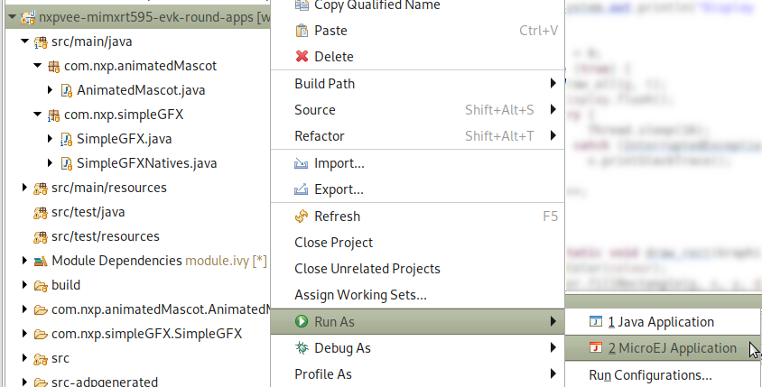

The IDE will prompt which application should be built: either `SimpleGFX` or `AnimatedMascot`:

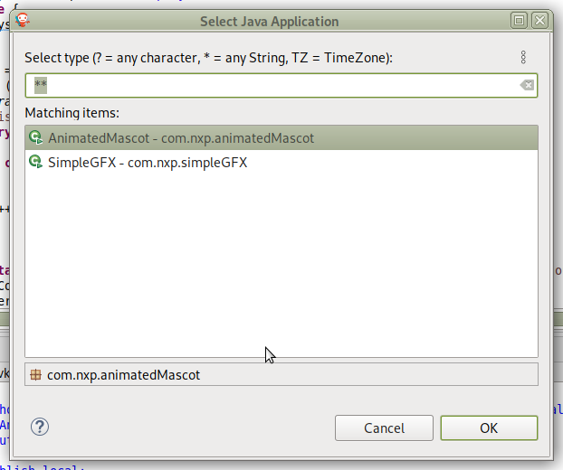

Choose the application. It will be built and automatically run using the simulator.

Here is the `AnimatedMascot` application running in simulation:

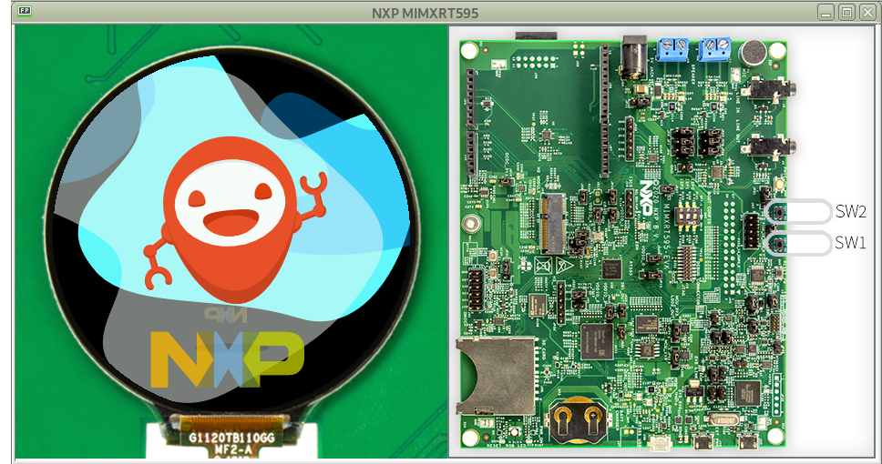

### Build and run applications in target mode
#### Build the applications
To build applications in target mode, right click on the apps project and select `Run As -> Run Configurations...`.

From there, select the applications' configuration and click on "Execute on Device as shown below:

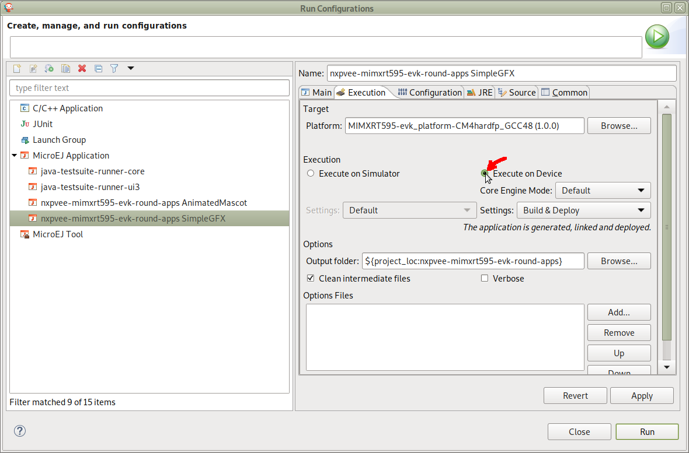

Please note that the applications must have first been run in simulation to appear in this `MicroEJ Application` list.

For the sake of simplicity, you can permanently duplicate the simulator configurations to create new target configurations.

When building in target mode for the first time, the SDK will warn you that a license is needed to build.

A MicroEJ license is required to build high level applications and the VEE Port for target hardware.

Evaluation licenses can be obtained for free. Please follow [the instructions from MicroEJ](https://docs.microej.com/en/latest/SDKUserGuide/licenses.html#evaluation-license).

With an evaluation license, you can build high level applications with no limitation in simulation mode. Applications built with an evaluation license will run for a limited time on target hardware.

Evaluation licenses must be renewed periodically (every month).

The build will produce two artifacts:

* *microejapp.o*: the Java application in bytecode
* *microejruntime.a*: the VEE itself, with its virtual machine

These artifacts are copied to the BSP project, in directory `projects/microej/platform/lib`.

#### Build the firmware for target hardware
Once the application is ready, the firmware can be built using a C toolchain for Cortex-M.

##### On Linux
The build system is based on CMake.

If not installed yet, please install it.

On Debian based distros, run:
```
sudo apt install cmake
```

The build system use an environment variable to locate the toolchain. This variable is called `ARMGCC_DIR` and must point to the root directory of the toolchain.

For instance:
```
export ARMGCC_DIR=/opt/gcc-arm-none-eabi-10.3-2021.10/
```

With all dependencies out of the way, go to the build directory, run the CMake configuration script and build the firmware:
```
cd /path/to/workspace/nxpvee-mimxrt595-evk-round-bsp/projects/microej/armgcc
./build_cmake.sh
make -j$(nproc)
```
The firmware will be available in current directory:
```
mimxrt595_freertos-bsp.axf (ELF file with symbols)
mimxrt595_freertos-bsp.bin (binary file)
```

##### On Windows
CMake should be installed on your computer. If not, you can install it from [this page](https://cmake.org/download/).

Make should also be installed on your computer. If not, you can install it from [here](https://gnuwin32.sourceforge.net/packages/make.htm#:~:text=Complete%20package%2C%20except%20sources).
Make sure than `make` is in your command path.

CMake may be asking you to declare the `ARMGCC_DIR` variable. It represents the path to your ARM toolchain folder (default is `C:\Program Files (x86)\GNU Arm Embedded Toolchain\10 2021.10`). You can declare it that way:
```
set ARMGCC_DIR="/path/to/your/ARMGCC/directory/"
```
or directly in your Windows environment variables, to prevent doing it everytime you open a new commmand prompt.

With all dependencies out of the way, go to the build directory, in a command prompt, run the CMake configuration script and build the firmware:
```
cd /path/to/workspace/nxpvee-mimxrt595-evk-round-bsp/projects/microej/armgcc
.\build_cmake.bat
make -j
```
The firmware will be available in current directory:
```
mimxrt595_freertos-bsp.axf (ELF file with symbols)
mimxrt595_freertos-bsp.bin (binary file)
```

#### Flash the EVK board
The easiest way to flash the board with the generated firmware is by using a J-Link probe.

J-Link software is available in [Segger's website](https://www.segger.com/downloads/jlink/).

Connect a J-Link probe to the EVK's debug connector (J2 or J19):

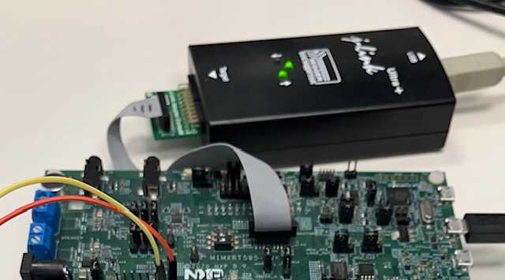

Assuming the Segger's tools are in your `PATH` variable, run the Python script prog.py:
```
prog.py
```

If the Segger's tools are not in your path, you can set the variable `JLINK_INSTALLATION_DIR` to point to the J-Link installation directory prior to run the `prog.py` script.

It will automatically launch the `JFlashLite` utility, flash the board and reboot it. It will also rebuild the firmware if needed prior to flashing.


#### Run the application
UART is available on pins J27-1 (RX), J27-2 (TX).

Use a 3.3V serial to USB cable to connect to the EVK's UART:


After powering up the board, the application will start automatically:

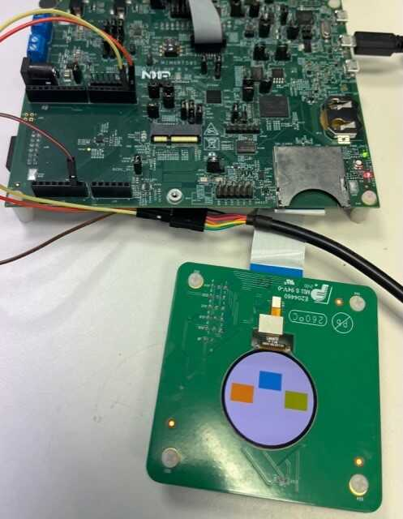

<u>Important note</u>:

Applications built with an evaluation license will freeze after a random period of time. A production license is necessary to have a fully working application on target.


## Switching to a production license
To switch to a production license, please contact your NXP representative.


## Using native C functions from the high level application
Some functions directly used by the high level application can be implemented in C, either for performance puposes or to have access to low level features (hardware access, C library binding...).

The SimpleGFX application makes use of C native function to calculate rectangles' coordinates (mainly for demonstration's sake).

### Declaring and using native functions in the Java world
Native functions can be declared as a public class in the application package. This public class contains methods with the same parameters as the C native functions.

The name of the C function is `Java_<package_name>_<class_name>_<method_name>`. Any underscore (`_`) character in either of `package_name`, `class_name`, or `function_name` is replaced by `_1`. Dots (`.`) are replaced by underscores `_`.

For these reasons, it is handy to stick to Java naming conventions and use camel case for class and method names and lower case only package names.

For example:
````
package com.nxp.application;

public class MyClassNatives {
	/* package */ native static int NativeFunction(int a);
};
````

This can be used in the application source code this way:
````
j = MyClassNatives.NativeFunction(i);
````

### Implementing the native functions in C world
The native functions are implemented in C, with a name deriving from the package name and the native class name.
In the previous example, we would have:
````
int Java_com_nxp_application_MyClassNatives_NativeFunction(int a)
{
    int i;

[...]

    return i;
}
````

### Implementing a mockup of the native functions for the simulator
Mockup functions are used to simulate the behaviour of native functions when using the MicroEJ SDK simulator. Mockups are detailed in details in the [MicroEJ website](https://docs.microej.com/en/latest/PlatformDeveloperGuide/mock.html).

They are implementated in a different MicroEJ SDK project (`nxpvee-mimxrt595-evk-round-mock`).

The name of the file containing the mockup functions is supposed to be the same as the one where the native functions are declared in the application project (e.g. `SimpleGFXNatives.java`).

The file may look like this:
````
package com.nxp.application;

public class MyClassNatives {
    static int NativeFunction(int a) {
        int i;

        [...]

        return i;
    }
};
````

Please note that this project mockup must be added as a dependency inside the platform's `module.ivy` file:


The `org` and `name` fields can be found inside the mockup's `module.ivy` file (respectively `organisation` and `module`):

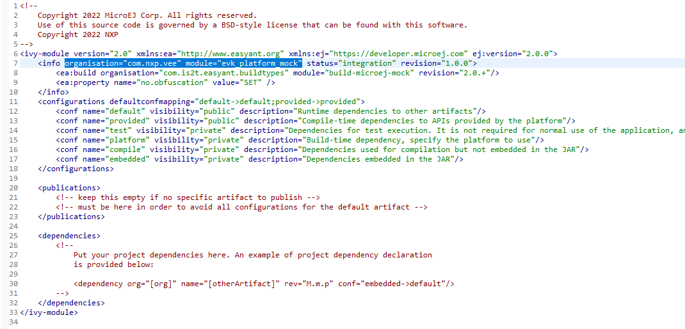

After any modification to the mockup project, you need to rebuild the mock (right click on the mock project and select `Build Module`) and the platform (see [Build the platform](#build-the-platform)).
